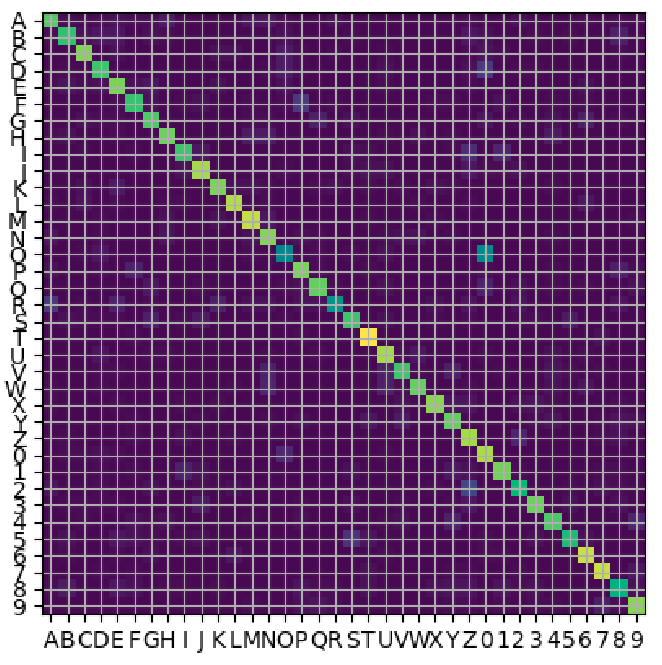
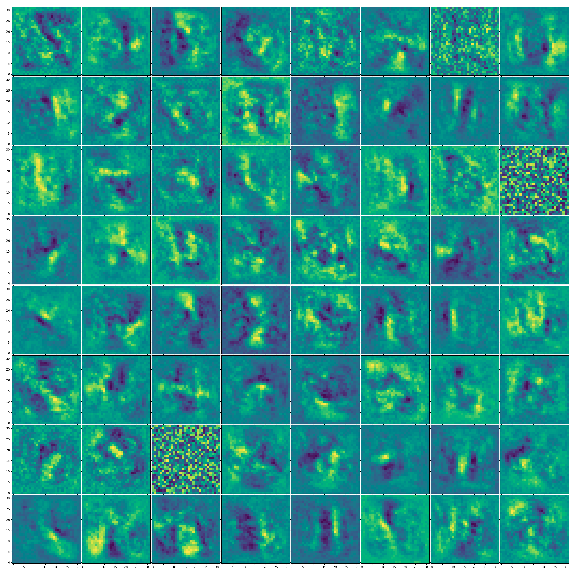
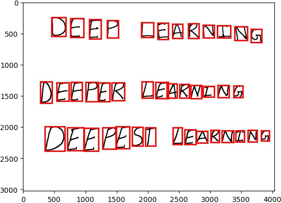
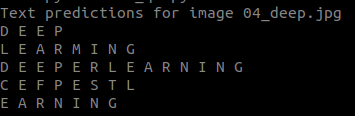
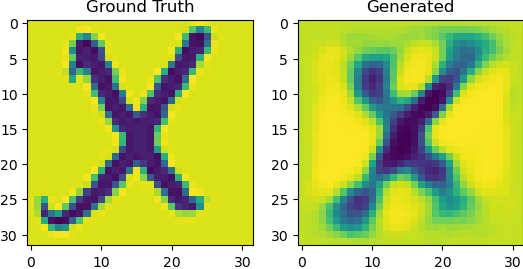

# Homework 5

## Neural Networks

### Fully Connected Network - NIST36 Recognition

Confusion Matrix on validation data:

Learned weights:

### Text Recognition and classification 

Detected letters:

Classified text:

### Image Compression with Auto-Encoders

